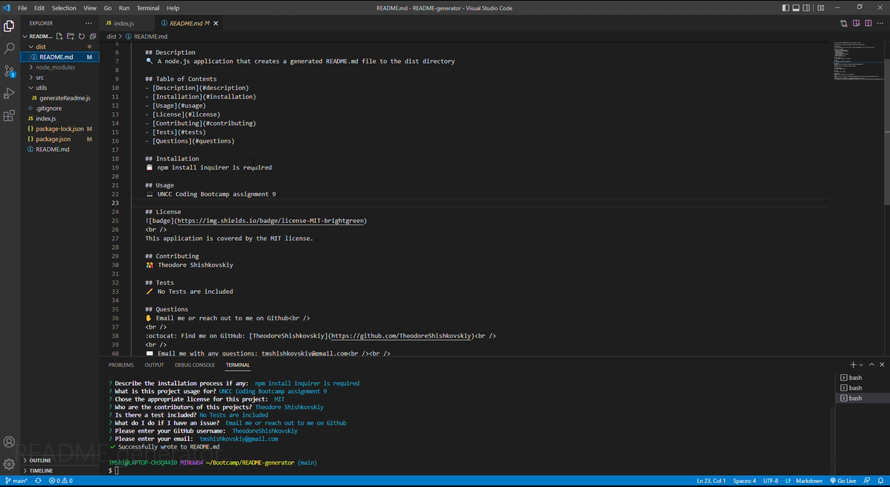

<h1 align="center">README.md Generator Using Node.js 👋</h1>
   

    
    
    
    

  

    
    
    
    
    
    

   
## Description
  
🔍 A node.js application that uses user input from inquirer to populate a README.md file for user repository. The README.md file is created in the dist directory and can be found [here](.dist/README.md)  
  
💻 Below is the gif showing the functionality of the application:
  

  
🎥 The full video file can be found here [here](https://drive.google.com/file/d/1YEqUbM-o4ioXhVvjrxeJhXtRuhtBlW4n/view?usp=sharing)  
  
## Table of Contents

- [Description](#description)
- [User Story](#user-story)
- [Acceptance Criteria](#acceptance-criteria)
- [Table of Contents](#table-of-contents)
- [Installation](#installation)
- [Usage](#usage)
- [Contributing](#contributing)
- [Questions](#questions)

## Installation
💾   
  
`npm init`
  
`npm install inquirer`
  
## Usage
💻   
  
Run the following command at th root of your project and answer the prompted questions:
  
`node index.js`

## Contributing
:octocat: [Ted Shishkovskiy](https://github.com/TheodoreShishkovskiy)

## Questions
✉️ Contact me with any questions: [email](mailto:tmshishkovskiy@gmail.com) , [GitHub](https://github.com/TheodoreShishkovskiy) 